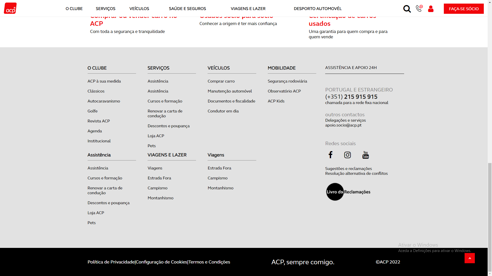
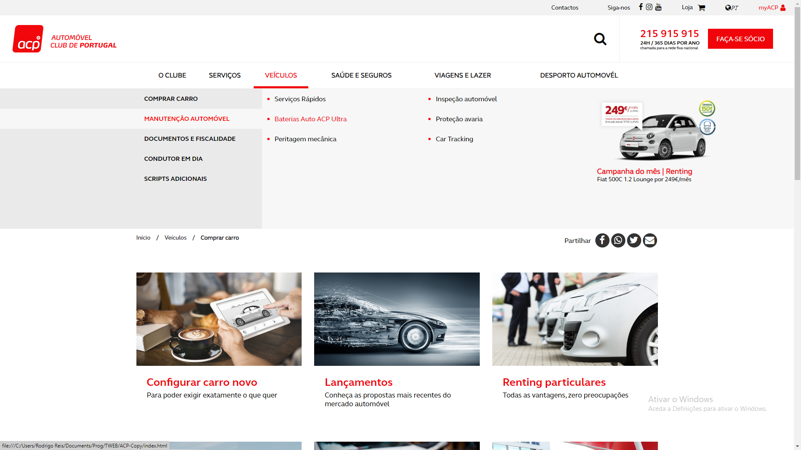

# Trabalho Prático de TWEB

## Introdução

Este trabalho prático foi realizado como parte da disciplina de TWEB (Tecnologia e Arquitetura de Computadores) na Universidade ISEC. O objetivo do trabalho era implementar as tecnologias abordadas nas aulas, como HTML, CSS e JavaScript.

O trabalho consistiu em replicar a imagem de um site de compra e venda de automóveis usados, utilizando exclusivamente HTML/CSS (SASS). Além disso, foram implementadas funcionalidades adicionais, como a determinação do preço do automóvel e cenários de financiamento com base em taxas de juros diferentes, desenvolvidas exclusivamente em JavaScript.

## Imagens

Aqui estão algumas capturas de tela do site:

### Topo do Site

### Rodapé do Site

### Menu de pesquisa

### Versão Mobile

